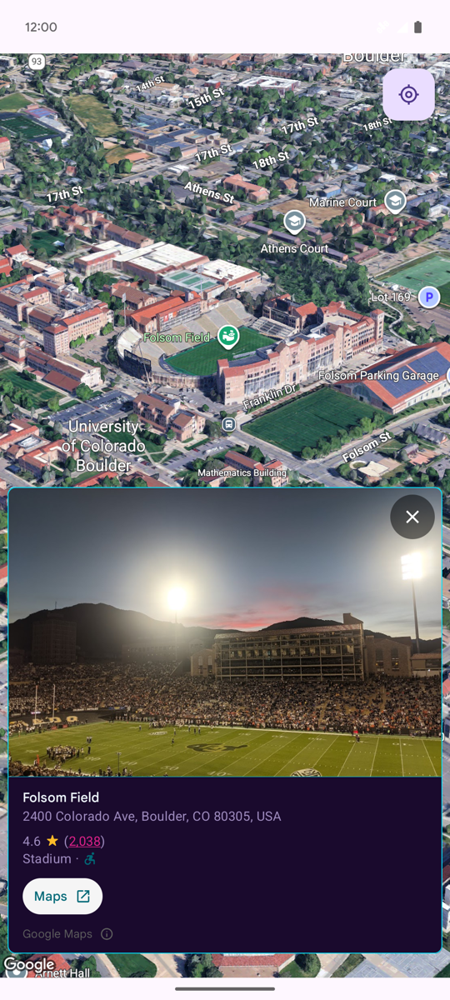

# Places UI Kit 3D Sample

This sample demonstrates how to integrate the Places SDK for Android's `PlaceDetailsCompactFragment` with a 3D map view. It allows users to tap on a location on a 3D Google Map to display its details in a compact, embedded view.

## Features

- **3D Google Map**: Utilizes the 3D Maps SDK to display a rich, interactive 3D map.
- **Place Details**: On tapping a location on the map, the app displays the place's details using the `PlaceDetailsCompactFragment`.
- **MVVM Architecture**: Follows the Model-View-ViewModel pattern, with a `MainViewModel` managing the UI state.
- **Location-Aware**: Requests location permissions to center the map on the user's current location.
- **Secrets Management**: Uses the Secrets Gradle Plugin for Android to securely handle the Google Maps API key.

## Screenshot



## Requirements

- Android Studio
- An Android device or emulator
- A Google Maps API key

## Setup and Installation

1.  **Clone the repository:**
    ```bash
    git clone https://github.com/googlemaps-samples/android-places-demos.git
    ```
2.  **Open the project in Android Studio:**
    Open the `PlacesUIKit3D` directory in Android Studio.

3.  **Add your API Key:**
    -   Create a file named `secrets.properties` in the root directory of the `PlacesUIKit3D` project (`/Users/dkhawk/AndroidStudioProjects/github-maps-code/android-places-demos/PlacesUIKit3D`).
    -   Add your Google Maps API key to the `secrets.properties` file, making sure that the Maps SDK for Android and the Places API are enabled for the key.
        ```
        MAPS3D_API_KEY="YOUR_API_KEY"
        PLACES_API_KEY="YOUR_API_KEY"
        ```
    - Note: The `secrets.properties` file is included in the `.gitignore` file to prevent it from being checked into version control.

## Running the Application

Once the project is set up and the API key is added, you can run the application on an Android device or emulator directly from Android Studio.

- The app will request location permissions.
- The map will center on the user's location if permission is granted, otherwise it will default to a location in Colorado.
- Tap on any location on the map to see the Place Details view.

## License

```
Copyright 2025 Google LLC

Licensed under the Apache License, Version 2.0 (the "License");
you may not use this file except in compliance with the License.
You may obtain a copy of the License at

     http://www.apache.org/licenses/LICENSE-2.0

Unless required by applicable law or agreed to in writing, software
distributed under the License is distributed on an "AS IS" BASIS,
WITHOUT WARRANTIES OR CONDITIONS OF ANY KIND, either express or implied.
See the License for the specific language governing permissions and
limitations under the License.
```
