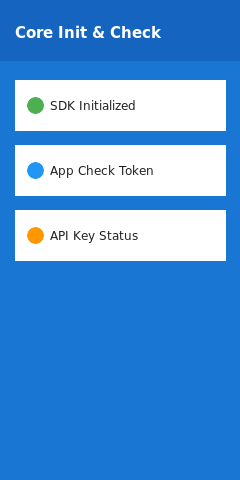
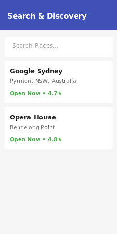
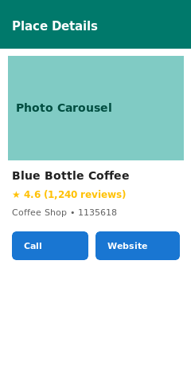
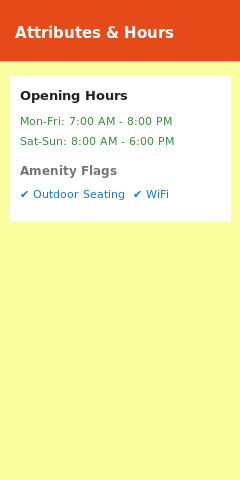
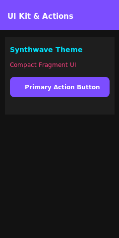
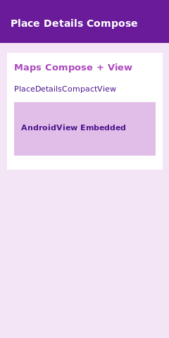
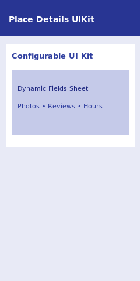
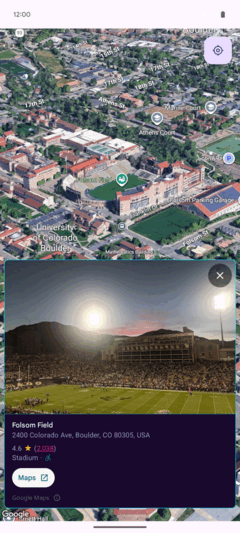

Google Places SDK for Android Demos
====================================


[](https://discord.gg/hYsWbmk)

This repository contains several standalone applications that demonstrate the features and capabilities of the [Google Places SDK for Android](https://developers.google.com/places/android-sdk/).

### 📸 Hero Sample Carousel

| Core Initialization | Search & Discovery | Place Details & Photos | Place Attributes & Hours | UI Kit & Actions | Place Details Compose | Place Details UIKit | Places UI Kit 3D |
| :---: | :---: | :---: | :---: | :---: | :---: | :---: | :---: |
| <a href="kotlin-compose-samples"></a> | <a href="kotlin-compose-samples"></a> | <a href="kotlin-compose-samples"></a> | <a href="kotlin-compose-samples"></a> | <a href="kotlin-compose-samples"></a> | <a href="PlaceDetailsCompose"></a> | <a href="PlaceDetailsUIKit"></a> | <a href="PlacesUIKit3D"></a> |
| [Core Init](kotlin-compose-samples) | [Search & Discovery](kotlin-compose-samples) | [Place Details](kotlin-compose-samples) | [Place Attributes](kotlin-compose-samples) | [UI Kit Actions](kotlin-compose-samples) | [Compose Demo](PlaceDetailsCompose) | [UIKit Demo](PlaceDetailsUIKit) | [3D Map Demo](PlacesUIKit3D) |

---

## 🗺️ Sample Catalog

### 1. 🌟 Redesigned Core Sample Suites (Places SDK v5.3.0+)
Standardized sample suites built across three modern Android UI architectures demonstrating end-to-end features of the Places SDK:

| Architecture | Language | Module Path | Documentation |
| :--- | :--- | :--- | :--- |
| **Android Views (XML Layouts)** | Java | [`:java-view-samples`](java-view-samples) | [README](java-view-samples/README.md) |
| **Android Views + ViewBinding** | Kotlin | [`:kotlin-view-samples`](kotlin-view-samples) | [README](kotlin-view-samples/README.md) |
| **Jetpack Compose + Material3** | Kotlin | [`:kotlin-compose-samples`](kotlin-compose-samples) | [README](kotlin-compose-samples/README.md) |

#### Core Feature Demonstrations Across All Suites:
- 🔑 **Core Initialization & App Check (`CoreInitializationDemo*`)**: Demonstrates Places SDK setup, API key verification, Firebase App Check integration, and session token state lifecycle.
- 🔍 **Search & Discovery (`SearchAndDiscoveryDemo*`)**: Demonstrates Place Autocomplete (Intent & Programmatic), Search Along Route, Autocomplete predictions, and Nearby Search queries.
- 🖼️ **Place Details & Photos (`PlaceDetailsAndPhotosDemo*`)**: Demonstrates fetching Place Details, loading photo metadata, async bitmap rendering, and review lists.
- 🕒 **Place Attributes & Hours (`PlaceAttributesAndHoursDemo*`)**: Demonstrates retrieving place field masks, price tiers, accessibility flags, and structured opening hours.
- 🎨 **Places UI Kit & Actions (`PlacesUIKitAndActionsDemo*`)**: Demonstrates embedding `PlaceDetailsCompactFragment` and `PlaceDetailsFragment` with custom Synthwave themes and action callbacks.

---

### 2. 🚀 Specialized UI Kit & Photorealistic 3D Demos

| Sample Module | Architecture | Key Features | Module Path | Documentation |
| :--- | :--- | :--- | :--- | :--- |
| **PlaceDetailsCompose** | Jetpack Compose + `AndroidView` | Integrates `PlaceDetailsCompactFragment` and `PlaceDetailsFragment` into Compose via `AndroidView` wrappers. Includes live view mode switching. | [`:PlaceDetailsCompose`](PlaceDetailsCompose) | [README](PlaceDetailsCompose/README.md) |
| **PlaceDetailsUIKit** | Android Views + Compose Dialog | Simple and configurable implementations of `PlaceDetailsCompactFragment`. Features interactive runtime field selection dialog. | [`:PlaceDetailsUIKit`](PlaceDetailsUIKit) | [README](PlaceDetailsUIKit/README.md) |
| **PlacesUIKit3D** | Photorealistic 3D Maps + UI Kit | Combines Places SDK `PlaceDetailsCompactFragment` with Photorealistic 3D Maps SDK for interactive 3D location flyovers. | [`:PlacesUIKit3D`](PlacesUIKit3D) | [README](PlacesUIKit3D/README.md) |

---

### 3. 📦 Base Demos & Developer Utility Suites

| Sample Module | Language / Framework | Purpose | Module Path |
| :--- | :--- | :--- | :--- |
| **demo-java** | Java | Base SDK Capabilities (Place Autocomplete, Place Details, Current Place) | [`:demo-java`](demo-java) |
| **demo-kotlin** | Kotlin | Idiomatic base Kotlin implementation of core SDK APIs | [`:demo-kotlin`](demo-kotlin) |
| **kotlin-demos** | Kotlin + Coroutines (KTX) | Uses `android-places-ktx` extension library for async coroutine flows | [`:kotlin-demos`](kotlin-demos) |
| **snippets** | Kotlin / Java | Code snippets referenced in official Google Places SDK developer guides | [`:snippets`](snippets) |

---

Getting Started
---------------

These demos use the Gradle build system.

First download the demos by cloning this repository or downloading an archived snapshot. (See the options on the right hand side.)

In Android Studio, use "Open an existing Android Studio project", and select the root directory (`android-places-demos`). This will load all the demo modules at once.

Alternatively use the `./gradlew assembleDebug` command from the root directory to build all projects simultaneously.

The demos require that you provide your own API keys. The project enforces the presence of required keys before the build can even start to prevent runtime crashes.

1. [Get an API Key](https://developers.google.com/places/android-sdk/get-api-key) with the **Places API (New)** and **Maps SDK for Android** enabled.
2. In the root directory, create a `secrets.properties` file (this is git-ignored to prevent accidental commits).
3. Add your keys. See `local.defaults.properties` for the complete list of required and secondary optional keys. At minimum, you must add the required keys:
   ```properties
   PLACES_API_KEY=AIza...
   MAPS_API_KEY=AIza...
   ```
   **Optional Keys:**
   There are also optional keys required for specific demos to function completely:
   *   `MAPS3D_API_KEY`: Required only for the `PlacesUIKit3D` demo to load the Photorealistic 3D Maps tiles.
   *   `MAP_ID`: Required only for the `PlaceDetailsCompose` demo to demonstrate cloud-based map styling.
   ```properties
   MAPS3D_API_KEY=AIza...
   MAP_ID=...
   ```
4. Sync the Android Studio project, build, and run any of the application modules.

### Running Demos via Command Line

Each runnable project includes a convenient `installAndLaunch` task. Instead of using Android Studio, you can natively build, install, and execute any demo directly on your connected device or emulator with a single command:

```bash
# Launch the redesigned Java Views Demo
./gradlew :java-view-samples:installAndLaunch

# Launch the redesigned Kotlin Views Demo
./gradlew :kotlin-view-samples:installAndLaunch

# Launch the redesigned Kotlin Compose Demo
./gradlew :kotlin-compose-samples:installAndLaunch

# Launch the standard Java Demo
./gradlew :demo-java:installAndLaunch

# Launch the Kotlin Demo
./gradlew :demo-kotlin:installAndLaunch

# Launch the Kotlin Coroutines (KTX) Demo
./gradlew :kotlin-demos:installAndLaunch

# Launch the Jetpack Compose Demo
./gradlew :PlaceDetailsCompose:installAndLaunch

# Launch the UIKit Demo
./gradlew :PlaceDetailsUIKit:installAndLaunch

# Launch the Photorealistic 3D Maps Demo
./gradlew :PlacesUIKit3D:installAndLaunch

# Launch the Documentation Snippets app
./gradlew :snippets:installAndLaunch
```

## Terms of Service

This sample uses Google Maps Platform services. Use of Google Maps Platform services through this sample is subject to the Google Maps Platform [Terms of Service].

If your billing address is in the European Economic Area, effective on 8 July 2025, the [Google Maps Platform EEA Terms of Service](https://cloud.google.com/terms/maps-platform/eea) will apply to your use of the Services. Functionality varies by region. [Learn more](https://developers.google.com/maps/comms/eea/faq).

This sample is not a Google Maps Platform Core Service. Therefore, the Google Maps Platform Terms of Service (e.g. Technical Support Services, Service Level Agreements, and Deprecation Policy) do not apply to the code in this sample.

## Support

This sample is offered via an open source [license]. It is not governed by the Google Maps Platform Support [Technical Support Services Guidelines], the [SLA], or the [Deprecation Policy]. However, any Google Maps Platform services used by the sample remain subject to the Google Maps Platform Terms of Service.

If you find a bug, or have a feature request, please [file an issue] on GitHub. If you would like to get answers to technical questions from other Google Maps Platform developers, ask through one of our [developer community channels]. If you'd like to contribute, please check the [contributing guide].

You can also discuss this sample on our [Discord server].

[API key]: https://developers.google.com/maps/documentation/android-sdk/get-api-key
[API key instructions]: https://developers.google.com/maps/documentation/android-sdk/config#step_3_add_your_api_key_to_the_project

[code of conduct]: CODE_OF_CONDUCT.md
[contributing guide]: CONTRIBUTING.md
[Deprecation Policy]: https://cloud.google.com/maps-platform/terms
[developer community channels]: https://developers.google.com/maps/developer-community
[Discord server]: https://discord.gg/hYsWbmk
[file an issue]: https://github.com/googlemaps-samples/android-places-demos/issues/new/choose
[license]: LICENSE
[pull request]: https://github.com/googlemaps-samples/android-places-demos/compare
[project]: https://developers.google.com/maps/documentation/android-sdk/cloud-setup#enabling-apis
[Sign up with Google Maps Platform]: https://console.cloud.google.com/google/maps-apis/start
[SLA]: https://cloud.google.com/maps-platform/terms/sla
[Technical Support Services Guidelines]: https://cloud.google.com/maps-platform/terms/tssg
[Terms of Service]: https://cloud.google.com/maps-platform/terms
[Google Maps Platform EEA Terms of Service]: https://cloud.google.com/terms/maps-platform/eea
[Learn more]: https://developers.google.com/maps/comms/eea/faq

