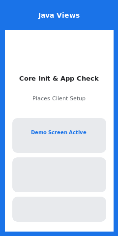
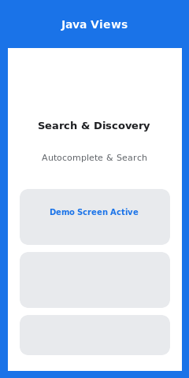
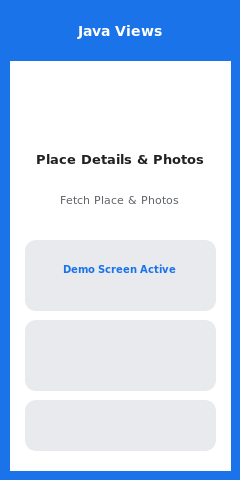
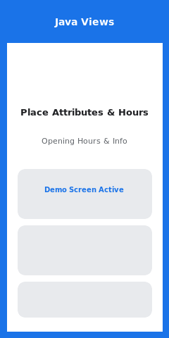
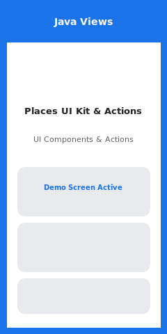

# Java View Samples (`:java-view-samples`)

This module provides comprehensive sample demonstrations written in **Java** using traditional **Android Views** and **Material 3 UI** to showcase the complete feature set and integration patterns of the Google Places SDK for Android (v5.3.0).

---

## 🗺️ Feature Catalog & Status

| Feature / Demo Area | Status | Source Code | Preview | Demonstrated APIs & Capabilities |
| :--- | :--- | :--- | :--- | :--- |
| **Core Initialization & App Check** |  | [`CoreInitializationDemoActivity.java`](src/main/java/com/google/android/libraries/places/samples/javaview/demos/CoreInitializationDemoActivity.java) |  | `Places.initializeWithNewPlacesApiEnabled()`, `Places.setPlacesAppCheckTokenProvider()`, `Places.deinitialize()`, `Places.isInitialized()`. Custom App Check token provider injection. |
| **Search & Discovery** |  | [`SearchAndDiscoveryDemoActivity.java`](src/main/java/com/google/android/libraries/places/samples/javaview/demos/SearchAndDiscoveryDemoActivity.java) |  | `searchByText()`, `searchNearby()`, `findCurrentPlace()`, `findAutocompletePredictions()`. Interactive search chips, location bias/restriction, and country type filters. |
| **Place Details & Photos** |  | [`PlaceDetailsAndPhotosDemoActivity.java`](src/main/java/com/google/android/libraries/places/samples/javaview/demos/PlaceDetailsAndPhotosDemoActivity.java) |  | `fetchPlace()`, `fetchPhoto()`, `fetchResolvedPhotoUri()`. Detailed `AddressDescriptor` parsing (`Area` containment & `Landmark` spatial relationship) and Glide image loading. |
| **Place Attributes & Hours** |  | [`PlaceAttributesAndHoursDemoActivity.java`](src/main/java/com/google/android/libraries/places/samples/javaview/demos/PlaceAttributesAndHoursDemoActivity.java) |  | `isOpen()`, `ContainingPlace`, `PriceRange`, `OpeningHours`, `AccessibilityOptions`, `EVChargeOptions`, `FuelPrice`. Dynamic business open/closed status calculation. |
| **Places UI Kit & Actions** |  | [`PlacesUIKitAndActionsDemoActivity.java`](src/main/java/com/google/android/libraries/places/samples/javaview/demos/PlacesUIKitAndActionsDemoActivity.java) |  | `AdvancedPlaceDetailsCompactFragment`, `AdvancedPlaceDetailsFragment`, `PlaceActionProvider` (`CALL`, `OPEN_WEBSITE`, `OPEN_DIRECTIONS`, `OPEN_IN_MAPS`), `SearchMediaOptions`, `SearchReviewsOptions`. |

---

## 🛠️ Key Java Code Implementation Examples

### 1. Initializing Places Client with App Check
```java
// Initialize Places API with new backend enabled
Places.initializeWithNewPlacesApiEnabled(getApplicationContext(), apiKey);

// Custom App Check Token Provider
Places.setPlacesAppCheckTokenProvider(() -> 
    Tasks.forResult("sample_app_check_token")
);

PlacesClient placesClient = Places.createClient(this);
```

### 2. Requesting 5.3.0 Place Fields & Parsing AddressDescriptor
```java
List<Place.Field> placeFields = Arrays.asList(
    Place.Field.ID,
    Place.Field.DISPLAY_NAME,
    Place.Field.ADDRESS_DESCRIPTOR,
    Place.Field.CONTAINING_PLACES,
    Place.Field.PRICE_RANGE
);

FetchPlaceRequest request = FetchPlaceRequest.builder("ChIJN1t_tDeuEmsRUsoyG83frY4", placeFields).build();
placesClient.fetchPlace(request).addOnSuccessListener(response -> {
    Place place = response.getPlace();

    // Inspecting 5.3.0 AddressDescriptor
    if (place.getAddressDescriptor() != null && place.getAddressDescriptor().getAreas() != null) {
        for (Area area : place.getAddressDescriptor().getAreas()) {
            Log.d("PlacesJava", "Area: " + area.getDisplayName() + " (" + area.getContainment() + ")");
        }
    }
});
```

### 3. Binding Custom Actions to Advanced Place UI Kit Fragments
```java
PlaceActionProvider actionProvider = new PlaceActionProvider() {
    @NonNull
    @Override
    public List<PlaceAction> getMainPlaceActions(@NonNull Place place) {
        return Arrays.asList(
            PlaceAction.CALL,
            PlaceAction.OPEN_WEBSITE,
            PlaceAction.OPEN_DIRECTIONS,
            PlaceAction.OPEN_IN_MAPS
        );
    }

    @NonNull
    @Override
    public List<CornerPlaceAction> getCornerPlaceActions(@NonNull Place place) {
        return Collections.emptyList();
    }

    @Override
    public void addPlaceActionsChangedListener(@NonNull PlaceActionProvider.OnChangedListener listener) {}

    @Override
    public void removePlaceActionsChangedListener(@NonNull PlaceActionProvider.OnChangedListener listener) {}
};

AdvancedPlaceDetailsCompactFragment fragment = AdvancedPlaceDetailsCompactFragment.newInstance(
    AdvancedPlaceDetailsCompactFragment.ALL_CONTENT,
    Orientation.VERTICAL,
    R.style.CustomizedPlaceDetailsTheme
);
fragment.setPlaceActionProvider(actionProvider);
```

---

## 🚀 Building & Running

To launch this Java View sample module directly onto your connected device or emulator:

```bash
./gradlew :java-view-samples:installAndLaunch
```
