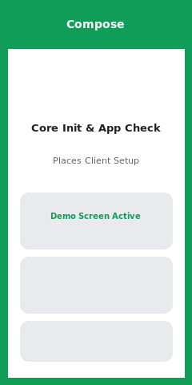
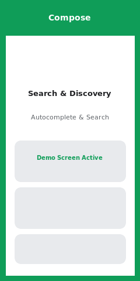
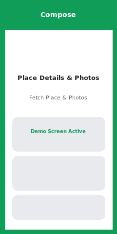
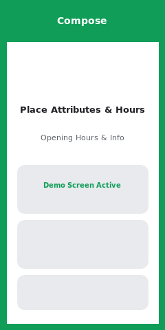
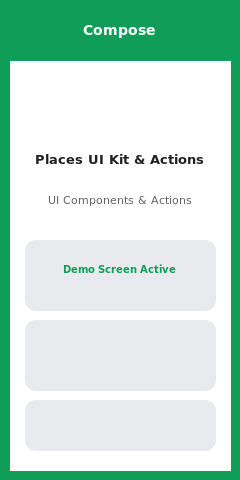

# Kotlin Compose Samples

This module contains sample demonstrations written in **Kotlin** using modern **Jetpack Compose** UI to showcase the features and integration patterns of the Google Places SDK for Android.

## 🗺️ Sample Status & Catalog

| Feature | Status | Source Code | Screenshot | Description |
| :--- | :--- | :--- | :--- | :--- |
| **Core Initialization & App Check** |  | [`CoreInitializationDemoScreen`](src/main/java/com/google/android/libraries/places/samples/kotlincompose/screens/CoreInitializationDemoScreen.kt) |  | Demonstrates initializing the `PlacesClient` with API key/App Check provider, validating initialization state, and performing basic API health checks using Jetpack Compose. |
| **Search & Discovery** |  | [`SearchAndDiscoveryDemoScreen`](src/main/java/com/google/android/libraries/places/samples/kotlincompose/screens/SearchAndDiscoveryDemoScreen.kt) |  | Demonstrates place search capabilities including Autocomplete predictions, Programmatic Search, Nearby Search, and Text Search APIs using Jetpack Compose UI. |
| **Place Details & Photos** |  | [`PlaceDetailsAndPhotosDemoScreen`](src/main/java/com/google/android/libraries/places/samples/kotlincompose/screens/PlaceDetailsAndPhotosDemoScreen.kt) |  | Demonstrates fetching comprehensive details for a specific Place ID, downloading high-resolution place photos, and rendering metadata in Compose. |
| **Place Attributes & Hours** |  | [`PlaceAttributesAndHoursDemoScreen`](src/main/java/com/google/android/libraries/places/samples/kotlincompose/screens/PlaceAttributesAndHoursDemoScreen.kt) |  | Demonstrates querying and displaying detailed place attributes, opening hours, current operational status, and special schedules in Compose. |
| **Places UI Kit & Actions** |  | [`PlacesUIKitAndActionsDemoScreen`](src/main/java/com/google/android/libraries/places/samples/kotlincompose/screens/PlacesUIKitAndActionsDemoScreen.kt) |  | Demonstrates integration of Places UI Kit components and custom user action providers with Jetpack Compose interoperability (`AndroidView`). |

## Prerequisites

1. Android Studio Jellyfish or newer.
2. Android API Level 21 or higher.
3. A valid Google Cloud project with the Places SDK for Android enabled and an API key configured in `secrets.properties`.

## Usage

Open the project in Android Studio, select the `kotlin-compose-samples` run target, and launch on an emulator or connected device.
