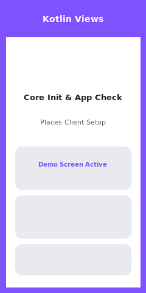
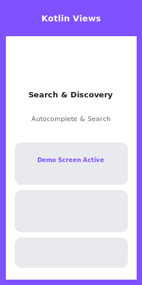
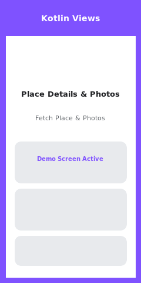
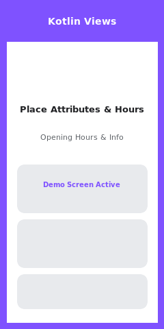
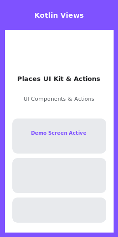

# Kotlin View Samples (`:kotlin-view-samples`)

This module provides comprehensive sample demonstrations written in **Kotlin** using traditional **Android Views**, **Material 3 UI**, **KTX Coroutines**, and **Coil** to showcase the full feature set and integration patterns of the Google Places SDK for Android (v5.3.0).

---

## 🗺️ Feature Catalog & Status

| Feature / Demo Area | Status | Source Code | Preview | Demonstrated APIs & Capabilities |
| :--- | :--- | :--- | :--- | :--- |
| **Core Initialization & App Check** |  | [`CoreInitializationDemoActivity.kt`](src/main/java/com/google/android/libraries/places/samples/kotlinview/demos/CoreInitializationDemoActivity.kt) |  | `Places.initializeWithNewPlacesApiEnabled()`, `Places.setPlacesAppCheckTokenProvider()`, `Places.deinitialize()`, `Places.isInitialized()`. Custom App Check token provider injection. |
| **Search & Discovery** |  | [`SearchAndDiscoveryDemoActivity.kt`](src/main/java/com/google/android/libraries/places/samples/kotlinview/demos/SearchAndDiscoveryDemoActivity.kt) |  | `searchByText()` / `awaitSearchByText()`, `searchNearby()`, `findCurrentPlace()`, `findAutocompletePredictions()`. Interactive search chips, location bias/restriction, and country type filters. |
| **Place Details & Photos** |  | [`PlaceDetailsAndPhotosDemoActivity.kt`](src/main/java/com/google/android/libraries/places/samples/kotlinview/demos/PlaceDetailsAndPhotosDemoActivity.kt) |  | `fetchPlace()` / `awaitFetchPlace()`, `fetchPhoto()`, `fetchResolvedPhotoUri()`. Detailed `AddressDescriptor` parsing (`Area` containment & `Landmark` spatial relationship) and Coil image loading. |
| **Place Attributes & Hours** |  | [`PlaceAttributesAndHoursDemoActivity.kt`](src/main/java/com/google/android/libraries/places/samples/kotlinview/demos/PlaceAttributesAndHoursDemoActivity.kt) |  | `isOpen()` / `awaitIsOpen()`, `ContainingPlace`, `PriceRange`, `OpeningHours`, `AccessibilityOptions`, `EVChargeOptions`, `FuelPrice`. Dynamic business open/closed status calculation. |
| **Places UI Kit & Actions** |  | [`PlacesUIKitAndActionsDemoActivity.kt`](src/main/java/com/google/android/libraries/places/samples/kotlinview/demos/PlacesUIKitAndActionsDemoActivity.kt) |  | `AdvancedPlaceDetailsCompactFragment`, `AdvancedPlaceDetailsFragment`, `PlaceActionProvider` (`CALL`, `OPEN_WEBSITE`, `OPEN_DIRECTIONS`, `OPEN_IN_MAPS`), `SearchMediaOptions`, `SearchReviewsOptions`. |

---

## 🛠️ Key Kotlin & KTX Coroutines Code Implementation Examples

### 1. Coroutines-first Place Details Fetching with KTX
```kotlin
val placeFields = listOf(
    Place.Field.ID,
    Place.Field.DISPLAY_NAME,
    Place.Field.ADDRESS_DESCRIPTOR,
    Place.Field.CONTAINING_PLACES,
    Place.Field.PRICE_RANGE
)

lifecycleScope.launch {
    try {
        val response = placesClient.awaitFetchPlace("ChIJN1t_tDeuEmsRUsoyG83frY4", placeFields)
        val place = response.place

        // Inspecting 5.3.0 AddressDescriptor
        place.addressDescriptor?.areas?.forEach { area ->
            Log.d("PlacesKotlin", "Area: ${area.displayName} (${area.containment})")
        }
    } catch (e: Exception) {
        Log.e("PlacesKotlin", "Fetch place failed", e)
    }
}
```

### 2. Searching Places Nearby with Coroutines DSL Builders
```kotlin
val request = searchNearbyRequest(
    locationRestriction = CircularBounds.newInstance(centerLatLng, radiusInMeters),
    placeFields = listOf(Place.Field.ID, Place.Field.DISPLAY_NAME, Place.Field.RATING)
) {
    setMaxResultCount(10)
    setIncludedTypes(listOf("restaurant", "cafe"))
}

lifecycleScope.launch {
    val response = placesClient.awaitSearchNearby(request)
    val places = response.places
}
```

### 3. Configuring PlaceActionProvider for UI Kit Widgets
```kotlin
val actionProvider = object : PlaceActionProvider {
    override fun getMainPlaceActions(place: Place): List<PlaceAction> {
        return listOf(
            PlaceAction.CALL,
            PlaceAction.OPEN_WEBSITE,
            PlaceAction.OPEN_DIRECTIONS,
            PlaceAction.OPEN_IN_MAPS
        )
    }

    override fun getCornerPlaceActions(place: Place): List<CornerPlaceAction> = emptyList()
    override fun addPlaceActionsChangedListener(listener: PlaceActionProvider.OnChangedListener) {}
    override fun removePlaceActionsChangedListener(listener: PlaceActionProvider.OnChangedListener) {}
}

val fragment = AdvancedPlaceDetailsCompactFragment.newInstance(
    AdvancedPlaceDetailsCompactFragment.ALL_CONTENT,
    Orientation.VERTICAL,
    R.style.CustomizedPlaceDetailsTheme
).apply {
    setPlaceActionProvider(actionProvider)
    applySearchMediaOptions(
        SearchMediaOptions.builder()
            .setQuery("menu")
            .setRankPreference(SearchMediaOptions.RankPreference.MOST_RELEVANT)
            .build()
    )
}
```

---

## 🚀 Building & Running

To launch this Kotlin View sample module directly onto your connected device or emulator:

```bash
./gradlew :kotlin-view-samples:installAndLaunch
```
